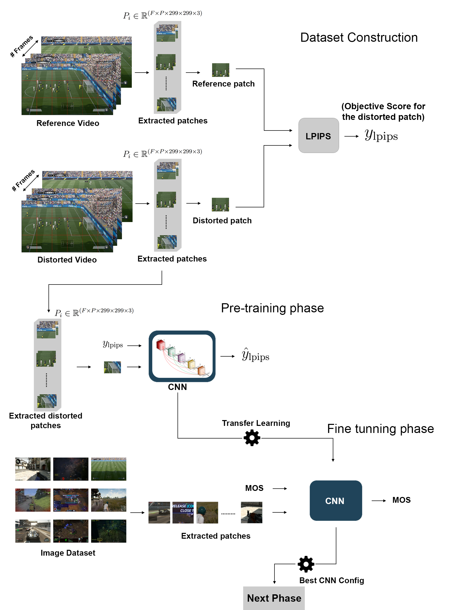
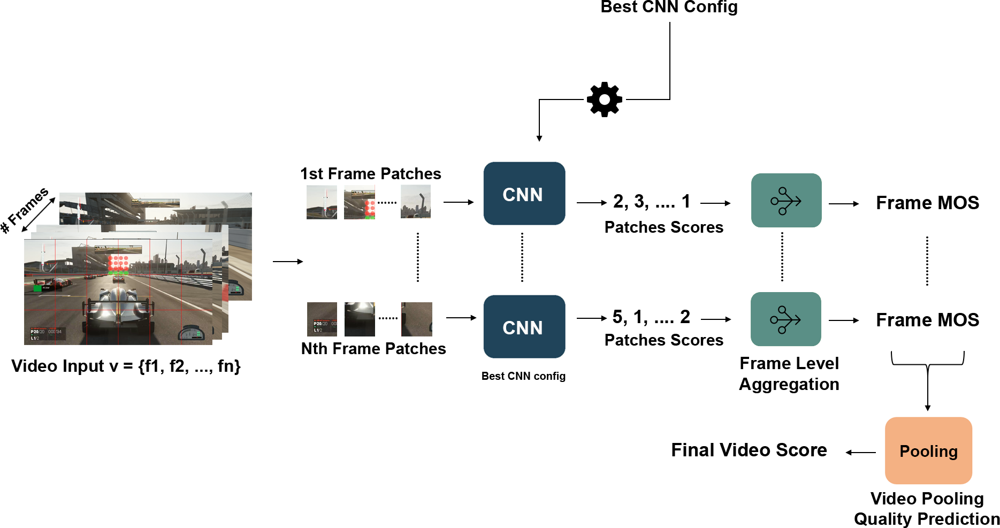

# Blind Quality Predictor for Cloud Gaming Videos (BQPCGV)

## Deep Learning based model Quality metric for Cloud Gaming Content


CNN-based model that accurately assesses the quality of videos in the cloud gaming domain. 
The process consists of three essential phases: Pre training, Fine-tuning, and Video Pooling Quality Prediction Phase.



<!--  -->
<!--  -->

This repository hosts the code for the complete development process of the three stages. It also provides testing capabilities tailored to your unique use case.

## How to Use

To test the model for a given video, follow these steps:

1. Run the `test.py` script with the following command:

    ```shell
        python test.py 
            --model=./models/model_Final_DMOS.h5 
            --videopath=./videos/ 
            --videoname=video1.mp4 
            --framepersecond=1
    ```

2. Use the following command-line options to configure the test:

- `--model` or `-m`: Specify the path to the model file.
- `--videopath` or `-vp`: Specify the folder path where the video is located.
- `--videoname` or `-vn`: Specify the name of the video file.
- `--framepersecond` or `-fps`: Specify the number of frames to process per second.

For more help run:
    
    ```shell
        python test.py 
            --model=./models/model_Final_DMOS.h5 
            --videopath=./videos/ 
            --videoname=video1.mp4 
            --framepersecond=1
    ```


<!-- ## How To Use

    - To test the model for a given video follow this process:
    <pre>
        python test.py 
            --model=./models/model_Final_DMOS.h5 
            --videopath=./videos/
            --videoname=video1.mp4 
            -framepersecond=1
    </pre>
    - --model or -m to select the model
    - --videopath or -vp for the video path folder
    - --videoname or -vn for the video name
    - --framepersecond or -fps for the number of frame per second to take -->
